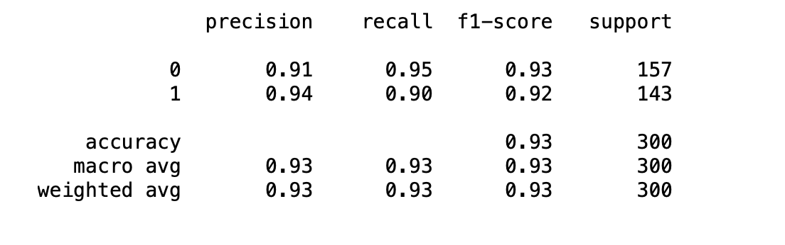

# <h1 align="center"><samp> Ad Click-Through Rate Prediction Project </samp></h1>

### Description:
In this project I will try to predict whether or not a particular internet user clicked on an Advertisement on a company website

### Data:
I will work on [this](advertising.csv) dataset. It contains the following features:
* 'Daily Time Spent on Site': consumer time on site in minutes
* 'Age': cutomer age in years
* 'Area Income': Avg. Income of geographical area of consumer
* 'Daily Internet Usage': Avg. minutes a day consumer is on the internet
* 'Ad Topic Line': Headline of the advertisement
* 'City': City of consumer
* 'Male': Whether or not consumer was male
* 'Country': Country of consumer
* 'Timestamp': Time at which consumer clicked on Ad or closed window
* 'Clicked on Ad': 0 or 1 indicated clicking on Ad

### Tools:
* Python
* Numpy
* Pandas
* Matplotlib
* Seaborn
* SciKitLearn
